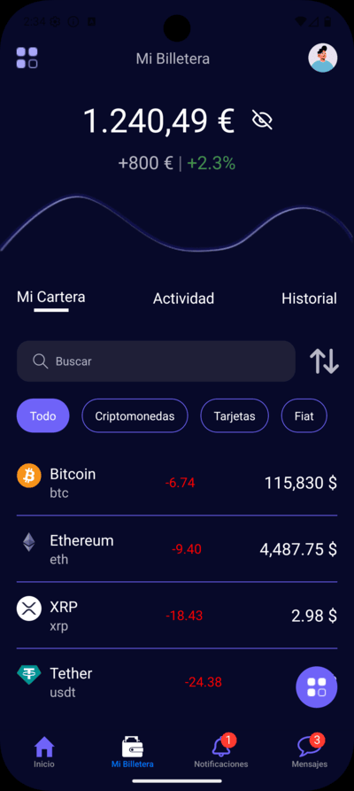

# Prueba de UI
Interfaz básica de la app [Jobchain](https://www.jobchain.com/) construida a modo de práctica.

Cuenta con una estructura basada en bottom tabs y la vista que se replicó fue **Mi Billetera** 

Se implementó consultas a una API gratuita para obtener los precios de las criptomonedas y react-native-pager-view para la animación de tabs y cambiar entre componentes con un swipe.

# Captura de pantallas.

## Android

## IOS
