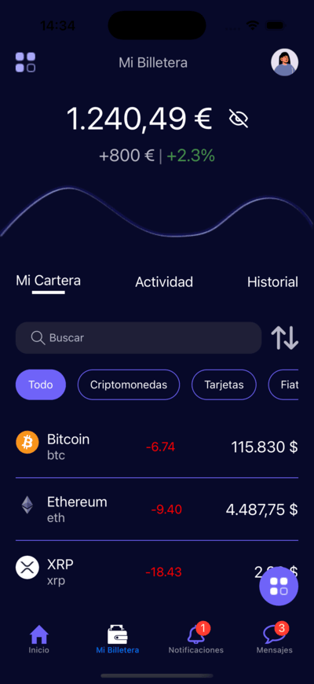

# Prueba de UI
Interfaz básica de la app [Jobchain](https://www.jobchain.com/) construida a modo de práctica.

Cuenta con una estructura basada en bottom tabs y las vistas que se replicaron fueron **Inicio**, **Mi Billetera** y **Buscar**.

Se implementó consultas a una API gratuita para obtener los precios de las criptomonedas y `react-native-pager-view` para la animación de tabs y cambiar entre componentes con un swipe, así como también consultas a otra API para obtener los videos, se implementó una librería para mostrar el mapa (`react-native-maps`) y se agregó una función para ir a la ubicación del dispositivo al presionar un botón. Para mostrar los videos uno después del otro se usó la misma librería de antes para la animación de los tabs pero en este caso de forma vertical y se instaló y configuró `expo-video` para mostrar los videos de la API con algunas características de rendimiento agregadas.

# Captura de pantallas.

## Android
   

## IOS
   